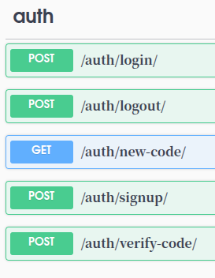
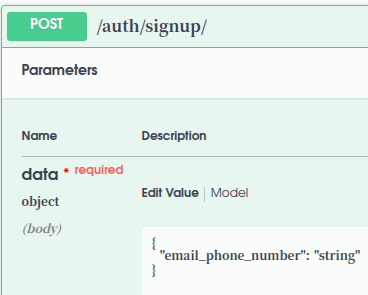
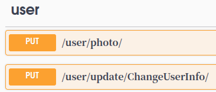

Assalomu Aleykum bu 8-oy Imtihon Loyihasi Qo'llash yuklash 
pip install -r requirements.txt
python manage.py migrate
python manage.py runserver

JARAYONDAGI APILAR
KIRIMLAR --- GET,POST
CHIQIMLAR --- GET,POST
HISOBLAR --- GET,POST
HISOBOTLAR --- GET

AUTH --- 
auth

POST
/auth/login/ -- EMAIL_PHONE 

POST
/auth/logout/ -- REFRESH TOKEN

GET
/auth/new-code/ -- NEW CODE SEND BORADI

POST
/auth/signup/ -- ROYHATDAN O'TISH  

POST
/auth/verify-code/ -- CODE VERIFY

 

Foydalanish Signup---> 

email yoki phone kiriting

access tokeni Bearer  Authorization qo'ying

va emailga yoki terminalga borgan sms 
POST
/auth/verify-code/

kiriting bergan access tokeni Bearer  Authorization qo'ying yana
PHOTO QOYING 
CHANGEUSERINFO PUT QILING KEYIN BOLDI KRIM  CHIQIM QOSHISH  IMKONI BOLADI
HISOBLAR HAM 

